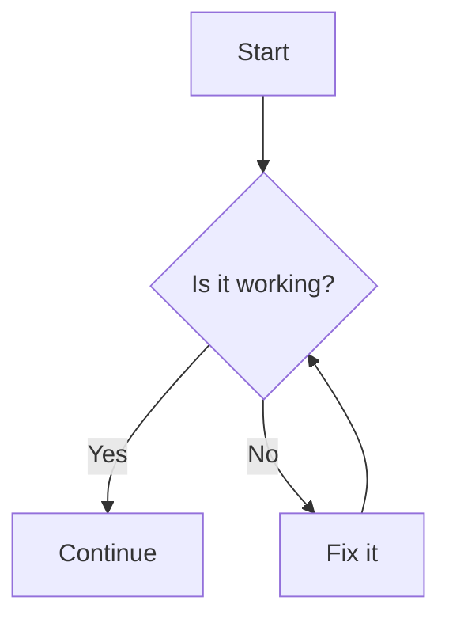

# Creating Flowcharts with Mermaid

Flowcharts are an integral part of my work. Whether it’s mapping out processes, planning projects, or visualizing ideas, a good flowchart can make all the difference. Over time, I've experimented with various tools to create these diagrams. Here, I want to share my experience with Mermaid, a powerful tool for creating flowcharts and other diagrams using simple code.

## The Hunt for the Perfect Flowchart Tool

I've tried several tools in my quest for the perfect flowchart creator. Here are some honorable mentions:

- **draw.io**: A versatile and user-friendly diagramming tool.
- **Excalidraw**: Great for hand-drawn style diagrams and recently added support for Mermaid.
- **Lucidchart**: A robust, professional-grade diagramming application.

These tools are fantastic, but I needed something that could be seamlessly embedded within markdown documents, which led me to discover Mermaid.

## What is Mermaid?

Mermaid is a tool that allows you to create diagrams and visualizations using a simple and easy-to-read code syntax. It's particularly useful for embedding within markdown documents, making it perfect for documentation and collaborative projects.

### Why Mermaid?

1. **Markdown Integration**: Mermaid lets you embed flowcharts directly within your markdown files. This keeps everything in one place and makes your documents more dynamic and interactive.
2. **Code-based Diagrams**: With Mermaid, you write diagrams as code. This approach is not only efficient but also allows for version control and easy updates.
3. **Versatility**: Beyond flowcharts, Mermaid supports Gantt charts, sequence diagrams, class diagrams, and more.

### Creating a Flowchart with Mermaid

Here’s an example of how you can create a simple flowchart using Mermaid:

````markdown

````

This code snippet generates a flowchart below with decision points and actions. Make sure to add to add `mermaid` tag in the code block to enable Mermaid rendering. Also, you need to enable Mermaid rendering in the YAML front matter of your markdown file with `mermaid: enabled: true`.


## Exporting Charts

One of my initial concerns was how to export these charts in high-quality formats like PDF or PNG. Thankfully, I found the [**Mermaid Live Editor**](https://mermaid.live/). This online tool allows you to create, preview, and export your Mermaid diagrams easily. It's very similar to Leaflet and operates on a freemium model.

## Interactive Features

When rendered within a markdown document, Mermaid charts offer neat interactive features:

- **Zoom**: Easily zoom in and out to focus on different parts of your chart.
- ~~**Rotate**~~ **Move** : ~~Rotate~~ Move your diagrams to get a better view or fit them into your layout. 
Okay, last time I checked, rotate feature was not available in the markdown preview, but it was instead the move feature, move the diagram (up, down, left, right) to fit your layout. Here's an example of how the github preview looks like, [from one of my personal projects](https://github.com/MDU-PHL/validation_ngmaster/blob/main/validation_panels/panels_flowchart.md).

## Extra Capabilities with Mermaid

Mermaid is continuously evolving, and there are several additional features worth mentioning:

- **Integration with Excalidraw**: Excalidraw now supports Mermaid, allowing you to combine hand-drawn elements with code-based diagrams.
- **AI Features**: Tools like GitHub Copilot can help you generate flowcharts from text descriptions. For example, using [this GitHub Action](https://github.com/marketplace/actions/export-mermaidjs-erdiagrams-from-database), you can convert database schemas to ER diagrams with ease.
- **Image Conversion**: You can even convert images into flowcharts using advanced AI capabilities.

In conclusion, Mermaid is a fantastic tool for anyone who needs to create and embed flowcharts and other diagrams within markdown documents. It’s easy to use, highly versatile, and offers excellent integration with other tools and platforms. If you’re in the market for a flowchart tool, give Mermaid a try – it might just be the perfect solution for your needs!
