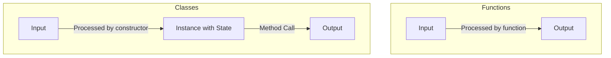

# **[DRAFT] Python functions vs. classes for building powerful Python CLI tools with Bioinformatics examples**  

Python has been my go-to language since I started working as a bioinformatician. However, I’ve realised that I haven’t used classes as much as I should have.  

In the fast-moving field of bioinformatics, Python is a top choice for building command-line interface (CLI) tools—thanks to its simplicity, rich ecosystem, and flexibility. Whether you're writing a quick script to process genomic data or developing a complex pipeline for sequence analysis, choosing between functions and classes can significantly impact your code’s efficiency, maintainability, and scalability.  

In this blog, we’ll break down the key differences between functions and classes, explore when to use each, and provide real-world bioinformatics examples. Along the way, I’ll share insights into how getting comfortable with Python classes can enhance your ability to build robust CLI tools.  

## **Functions vs. classes: a visual overview**

To illustrate the fundamental difference between functions and classes, here’s a simple diagram:  



- **Functions** take an input, process it, and return an output.  
- **Classes** not only take input and produce output but also maintain a state, allowing data to persist across method calls.  

---

## **Python functions: making your code reusable**  

One of the core principles of programming is **DRY**—*"Don't Repeat Yourself."* I’ve relied on functions to make my code more reusable and efficient from the start.  Functions are **straightforward and simple**. They act as self-contained blocks of code designed to perform a specific task. Functions are particularly useful when you need to repeat an operation multiple times but don’t want to rewrite the same code.  They are perfect for operations that don’t require maintaining state between calls.

### **Hmm... What Does "Maintaining State Between Calls" Mean?🤔**  

When we say functions don’t "maintain state between calls," it simply means that every time you call a function, it starts fresh—forgetting anything from previous runs. Functions take input, process it, and return an output without remembering any past data.  

For example, if you construct a function to calculate the **GC content** (the percentage of guanine and cytosine) in a DNA sequence—a common task in bioinformatics—you can use a simple function like this:  

```python
def gc_content(sequence):
    """Calculate the GC content percentage of a DNA sequence."""
    gc_count = sequence.count("G") + sequence.count("C")
    return 100 * gc_count / len(sequence)

# Usage
dna_seq = "ATGCGATACGCTTGC"
print("GC Content:", gc_content(dna_seq))
```
Here, `gc_content` is the **function name**, and `sequence` is a **parameter** that allows you to pass any DNA sequence as input. The function counts the number of **G** and **C** nucleotides in the sequence and returns the GC content percentage. `sequence.count("G") + sequence.count("C")` counts the **G** and **C** nucleotides, while `return 100 * gc_count / len(sequence)` computes and returns the GC content percentage.

Functions like this are great when you have **clear inputs and outputs** without needing to store extra data. But what if your program requires keeping track of information across multiple calls? That’s where **classes** come in—let’s explore that next!  

---

## **Python classes: organising data and behavior**  

While functions are great for simple, reusable operations, **classes** take things a step further. Classes act as blueprints for creating objects that bundle both **data** and **behavior** (methods). They are incredibly useful when you want to maintain **state** between calls or model complex entities. In bioinformatics, this is particularly relevant when you need to represent biological sequences, genes, or proteins.

Imagine you're developing a **bioinformatics CLI tool** that processes various biological sequence records. Instead of passing raw data between functions, you can create a `SequenceRecord` class to encapsulate relevant properties (like the sequence ID and nucleotide string) alongside methods for operations such as **transcription** or **reverse complement calculation**.  Note it is a norm to name the class in a Pascal case, i.e. each word starts with a uppercase letter without spaces (e.g. `SequenceRecord` instead of `sequence_record`).


### **Example: using a class for sequence records**  

```python
class SequenceRecord:
    def __init__(self, identifier, sequence):
        self.identifier = identifier
        self.sequence = sequence

    def gc_content(self):
        gc_count = self.sequence.count("G") + self.sequence.count("C")
        return 100 * gc_count / len(self.sequence)

    def reverse_complement(self):
        complement = {"A": "T", "T": "A", "G": "C", "C": "G"}
        return "".join(complement[base] for base in self.sequence[::-1])

# Usage of SequenceRecord class
record = SequenceRecord("seq1", "ATGCGATACGCTTGC")

# Accessing object properties and methods
print(record)
print("Sequence:", record.sequence)
print("Identifier:", record.identifier)
print("GC Content:", record.gc_content())
print("Reverse Complement:", record.reverse_complement())
```

### **Output:**

```console
<__main__.SequenceRecord object at 0x0000023EE513CF10>
Sequence: ATGCGATACGCTTGC
Identifier: seq1
GC Content: 53.33%
Reverse Complement: GCAAGCGTATCGCAT
```

Note, when you print the `record` object by itself, it shows the memory address of the object. The class `SequenceRecord` bundles related data and methods together, making it easier to manage and manipulate sequence records. In this example, there are two methods: `gc_content` and `reverse_complement`, which operate on the sequence data stored in the object.
`record` is an **instance** of the `SequenceRecord` class, and you can call its methods to perform operations on the sequence data.
_If you want an analogy, think of a class as a form that needs to be filled out. The instance of the class is the filled-out form, which contains the data you entered._Each instance (like `record`) contains unique data but follows the same structure. By using a class, you can group related methods and state together, making it easier to manage complex workflows—especially when your CLI tool must handle multiple types of data. 

---

## **When to use functions vs. classes**  

### **Simplicity vs. Structure**  

| Use Functions When... | Use Classes When... |
|----------------------|----------------------|
| Your task is **simple and stateless** | You need to **group related data and behavior** |
| You just need a **single reusable operation** | Your code requires **maintaining state** between calls |
| You want a **quick, lightweight approach** | You're working with **complex data structures** |
| Example: Computing **GC content** | Example: Representing **biological sequences** |

In bioinformatics, functions work best for **small, focused tasks**, while classes shine when dealing with **structured data** like **genes, proteins, or sequence records**.  

---

## **Building CLI tools: combining functions and classes**  

Modern **Python CLI tools** often mix both approaches. Libraries like **argparse** or **Click** help process command-line arguments while keeping the core logic clean and modular. Let’s look at an example:  

### **Example: FASTA file parser with a CLI**  

```python
import argparse

class FastaRecord:
    def __init__(self, identifier, sequence):
        self.identifier = identifier
        self.sequence = sequence

    def gc_content(self):
        gc_count = self.sequence.count("G") + self.sequence.count("C")
        return 100 * gc_count / len(self.sequence)

def parse_fasta(file_path):
    records = []
    with open(file_path, 'r') as f:
        identifier = None
        seq_lines = []
        for line in f:
            line = line.strip()
            if line.startswith(">"):
                if identifier:
                    records.append(FastaRecord(identifier, "".join(seq_lines)))
                identifier = line[1:]  # Remove '>'
                seq_lines = []
            else:
                seq_lines.append(line)
        if identifier:
            records.append(FastaRecord(identifier, "".join(seq_lines)))
    return records

def main():
    parser = argparse.ArgumentParser(description="Process FASTA files and compute GC content.")
    parser.add_argument("fasta_file", type=str, help="Path to the FASTA file")
    args = parser.parse_args()

    records = parse_fasta(args.fasta_file)
    for record in records:
        print(f"{record.identifier}: GC Content = {record.gc_content():.2f}%")

if __name__ == "__main__":
    main()
```

### **How this code works**  

1. **`FastaRecord` Class:** Stores the sequence **ID** and **nucleotide string**, providing a method to compute **GC content**.  
2. **`parse_fasta` Function:** Reads a **FASTA file**, extracts sequence data, and creates `FastaRecord` objects.  
3. **`main` Function:** Uses **argparse** to accept a **file path** as input, then processes and prints GC content for each sequence in the file.  

#### **Running the CLI Tool on real data**  

```sh
# copy the python code above into a file called fasta_gc.py
nano fasta_gc.py
# download a sequence file of a sample bacterial genome of Haemophilus influenzae
wget https://raw.githubusercontent.com/MDU-PHL/hicap/refs/heads/master/example/Hi75.fasta
# view the FASTA file
less Hi75.fasta
# run the CLI tool to compute GC content and print the first few lines of output
python fasta_gc.py Hi75.fasta | head
```

### **Sample output:**  
```console
NODE_1: GC Content = 37.41%
NODE_2: GC Content = 37.34%
NODE_3: GC Content = 37.73%
NODE_4: GC Content = 38.46%
NODE_5: GC Content = 37.63%
```

Viola! You’ve built a simple CLI tool to parse FASTA files and compute GC content and tested it on a real dataset.

With this approach, we **separate concerns**:
- **File parsing** is handled by a **function** (`parse_fasta`).
- **Sequence representation and operations** are handled by a **class** (`FastaRecord`).
- **Command-line interaction** is handled by **argparse** in the `main()` function.  

This **modular design** makes it easier to test, maintain, and extend.

---

If you are interested in diving deeper, there's a whole philosophy of **Object-Oriented Programming (OOP)** built around classes. Python is a **dynamic** language that supports both **functional** and **object-oriented** programming.  

- **Some languages, like Java, are class-heavy**, forcing everything into objects.  
- **Others, like Haskell, follow a functional paradigm**, relying entirely on pure functions.  
- **Python gives you the best of both worlds**, allowing you to choose the right tool for the job.  

## **Finding the Right Balance**  

If you've been writing **large, monolithic functions**, consider **refactoring your code into classes** for better structure. However, **not everything needs to be a class**—sometimes, a well-designed function is the simplest and most effective approach.  

---

## **Final Thoughts**  

Understanding the differences between **functions and classes** in Python is essential for writing **clean, efficient, and scalable bioinformatics tools**. By thoughtfully combining both, you can build **powerful CLI tools** that streamline your workflow and handle **complex biological data** with ease.  

For further exploration, check out these resources:  
- [Object-Oriented Programming (OOP) in Python](https://realpython.com/python3-object-oriented-programming/)
- [Biopython Tutorial and Cookbook](https://biopython.org/docs/latest/Tutorial/chapter_introduction.html)  
- [Things I’ve Learned About Building CLI Tools in Python – Simon Willison](https://simonwillison.net/2023/Sep/30/cli-tools-python/)  

Keep experimenting, keep coding, and most importantly—have fun! 

Happy coding! 😊
